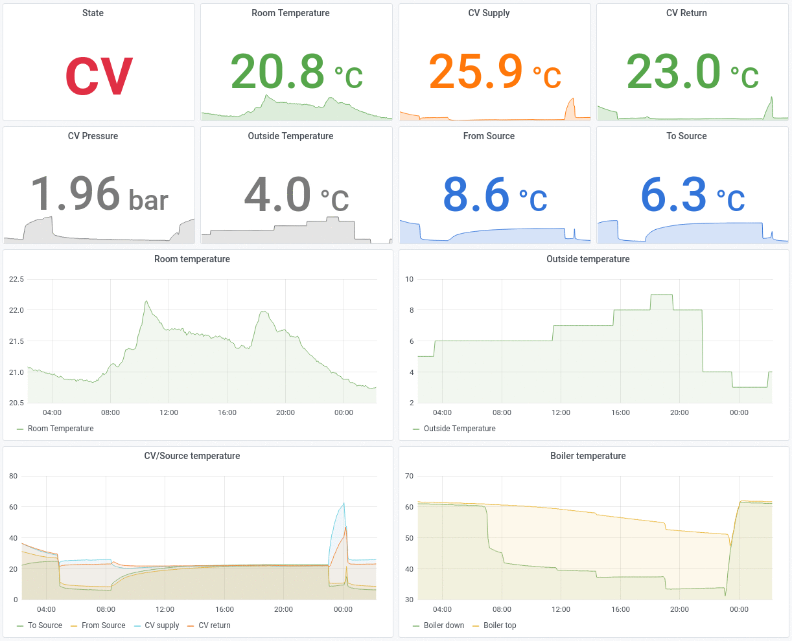

# python-itho-wpu

A python library and a set of command line tools to communicate with an Itho WPU.

[](#grafana-dashboard)

# Hardware installation

See the [pislave](https://github.com/ootjersb/pislave#wiring) project

# Software installation

1. Install [Raspberry Pi OS Lite](https://www.raspberrypi.org/software/operating-systems/)

1. Enable [SSH](https://www.raspberrypi.org/documentation/remote-access/ssh/) and [I2C](https://learn.adafruit.com/adafruits-raspberry-pi-lesson-4-gpio-setup/configuring-i2c) using `raspi-config`

1. Install and configure the required software
   ```
   apt-get install \
       git \              # To clone this repository
       pigpiod \          # Pigpio daemon to communicate over the I2C bus
       python3-pigpio \   # Python module to talk to the pigpio daemon
       python3-pyodbc \   # Python module to access an ODBC database
       odbcinst1debian2 \ # Library for accessing ODBC config files (odbc-mdbtools dependency)
       sqlite3 \          # To store a subset of the Itho database in SQLite
       direnv \           # Environment variable manager to store credentials for InfluxDB
       python3-influxdb   # To export measurements to InfluxDB

   # Set the sample rate value of pigpiod to 10 microseconds to decrease CPU usage
   sed -i -e 's/ExecStart=.*/ExecStart=\/usr\/bin\/pigpiod -l -s 10/' /lib/systemd/system/pigpiod.service

   # Enable pigpiod service
   systemctl enable pigpiod
   ```

   Install version 0.9.3-1 of odbc-mdbtools
   ```
   SOURCE=http://snapshot.debian.org/archive/debian/20210503T151244Z
   ARCH=$(dpkg --print-architecture)
   VERSION=0.9.3-1
   curl -OL ${SOURCE}/pool/main/m/mdbtools/odbc-mdbtools_${VERSION}_${ARCH}.deb
   curl -OL ${SOURCE}/pool/main/m/mdbtools/libmdb3_${VERSION}_${ARCH}.deb
   curl -OL ${SOURCE}/pool/main/m/mdbtools/libmdbsql3_${VERSION}_${ARCH}.deb
   dpkg -i libmdb3_${VERSION}_${ARCH}.deb libmdbsql3_${VERSION}_${ARCH}.deb odbc-mdbtools_${VERSION}_${ARCH}.deb
   ```
   *When executing `convert-itho-db.py` with mdbtools version ...*
   * *0.7.1-6 (Debian Buster) it fails with: `ValueError: the query contains a null character`*
   * *0.9.1-1 (Debian Bullseye) it fails with: `Segmentation fault`*

1. Reboot the Raspberry Pi
   ```
   reboot
   ```

1. Install python-itho-wpu
   ```
   git clone https://github.com/pommi/python-itho-wpu.git
   cd python-itho-wpu
   ```

1. Extract `$_parameters_HeatPump.par` from the Itho Service Tool. This is a Microsoft Access database containing details about all WPU versions.
   * Download it directly:
     ```
     curl -o HeatPump.par "https://servicetool.blob.core.windows.net/release/Parameters/\$_parameters_HeatPump.par"
     ```
   * Or download the [Itho Service Tool](https://www.ithodaalderop.nl/nl-NL/professional/servicetool) and execute `AzureBootloader.exe` to retrieve the full Itho Service Tool application. `$_parameters_HeatPump.par` is located in the `Parameters` directory. Save it as HeatPump.par in the python-itho-wpu folder.

1. Convert the Microsoft Access database to an SQLite datbase. The SQLite database is used by python-itho-wpu.
   ```
   ./convert-itho-db.py --itho-db HeatPump.par
   ```

# Example usage of python-itho-wpu

* Get the NodeID of the WPU
  ```
  # ./itho-wpu.py --action getnodeid
  ManufacturerGroup: 1, Manufacturer: HCCP, HardwareType: WPU, ProductVersion: 25, ListVersion: 11
  ```

* Get the Serial number of the WPU
  ```
  # ./itho-wpu.py --action getserial
  Serial: 408
  ```

* Get the Datalog of the WPU
  ```
  # ./itho-wpu.py --action getdatalog
  Buitentemp (°C): 8.0
  Boilertemp Onder (°C): 24.23
  Boilertemp Boven (°C): 51.68
  Verdamper Temp (°C): 19.84
  Zuiggas Temp (°C): 21.7
  Persgas Temp (°C): 30.22
  Vloeistof Temp (°C): 18.67
  Temp Naar Bron (°C): 21.09
  Temp Uit Bron (°C): 19.75
  ...
  ```

* Retrieve a single setting from the WPU
  ```
  # ./itho-wpu.py --action getsetting --id 1
  1. Hardware Configuratie: 70 (min: 0, max: 65535, step: 1)
  ```

* Retrieve all settings from the WPU
  ```
  # ./itho-wpu.py --action getsettings
  0. Niet Gebruikt: 0 (min: 0, max: 65535, step: 1)
  1. Hardware Configuratie: 70 (min: 0, max: 65535, step: 1)
  2. Jaar Inbedrijfstelling: 2010 (min: 2004, max: 2099, step: 1)
  3. Datum Van Inbedrijfstelling: 101 (min: 0, max: 3112, step: 1)
  4. Max Handbedieningstijd (min): 0 (min: 0, max: 600, step: 1)
  5. Vorsttemp (°C): 2.0 (min: -10.0, max: 10.0, step: 0.1)
  6. Offset Voor Vorst Temp (K): 2.0 (min: 0.0, max: 10.0, step: 0.1)
  7. Differentie Van Vorst Om Elektrisch Element Te Starten (K): 1.5 (min: 0.0, max: 10.0, step: 0.1)
  8. Fout Reset Tijd (min): 120 (min: 1, max: 1440, step: 1)
  9. Loginterval Tijd (sec): 5 (min: 1, max: 300, step: 1)
  ...
  ```

* Change a setting of the WPU
  ```
  # ./itho-wpu.py --action setsetting --id 139 --value 48
  Current setting:
  139. Blokkade Tijd Van Verwarmen Naar Koelen (uur): 24 (min: 0, max: 168, step: 1)
  Setting `139` will be changed to `48`? [y/N] y
  Updating setting 139 to `48`
  Are you really sure? (Type uppercase yes): YES
  139. Blokkade Tijd Van Verwarmen Naar Koelen (uur): 48 (min: 0, max: 168, step: 1)
  ```

* Retrieve a manual operation setting from the WPU
  ```
  # ./itho-wpu.py --loglevel info --action getmanual --id 0
  0. Buitentemp (°C): 10.0
  ```

* Initiate a manual operation
  ```
  # ./itho-wpu.py --action setmanual --id 0 --value 29.00
  Current manual operation:
  0. Buitentemp (°C): 10.0
  Manual `0` will be changed to `29.0`? [y/N] y
  Updating manual operation 0 to `29.0`
  Are you really sure? (Type uppercase yes): YES
  ```

* Finish a manual operation
  ```
  # ./itho-wpu.py --action setmanual --id 0 --value 29.00 --no-check
  Current manual operation:
  0. Buitentemp (°C): 29.0
  Manual `0` will be changed to `29.0`? [y/N] y
  Updating manual operation 0 to `29.0`
  Are you really sure? (Type uppercase yes): YES
  ```

* Reset all errors:
  ```
  # ./itho-wpu.py --action setmanual --id 37 --value 1
  Current manual operation:
  37. Reset Alle Fouten: 0
  Manual `37` will be changed to `1`? [y/N] y
  Updating manual operation 37 to `1`
  Are you really sure? (Type uppercase yes): YES
  ```

* Reset timer:
  ```
  # ./itho-wpu.py --action setmanual --id 38 --value 1
  Current manual operation:
  38. Reset Timer: 0
  Manual `38` will be changed to `1`? [y/N] y
  Updating manual operation 38 to `1`
  Are you really sure? (Type uppercase yes): YES
  ```

# Exporting measurements

## InfluxDB

Assuming InfluxDB is running on the Raspberry Pi as well.

1. Configure a `.envrc` file
   ```
   cat > .envrc <<EOT
   export INFLUXDB_HOST=127.0.0.1
   export INFLUXDB_USERNAME=user
   export INFLUXDB_PASSWORD=password
   export INFLUXDB_DATABASE=itho
   EOT
   ```

1. Allow direnv to load environment variables from the .envrc file
   ```
   direnv allow
   ```

1. Execute `itho-wpu.pu` and export to InfluxDB
   ```
   ./itho-wpu.py --action getdatalog --export-to-influxdb
   ```

1. Alternatively run this in a 5 minute cronjob (the console output is written to `/var/log/itho.log`)
   ```
   cat > /etc/cron.d/itho <<EOT
   PATH=/usr/bin:/bin:/usr/sbin:/sbin

   */5 * * * * root cd /root/python-itho-wpu && DIRENV_LOG_FORMAT='' direnv exec . ./itho-wpu.py --action getdatalog --export-to-influxdb >> /var/log/itho.log
   EOT
   ```

## Grafana Dashboard

The measurements collected in InfluxDB can be displayed using a Grafana dashboard.

Download: [direct link](assets/grafana-influxdb-dashboard.json), [grafana.com](https://grafana.com/grafana/dashboards/14143)
